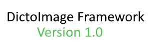

## Dictoimage framework


------
Version: 1.0\
Build 1.0

The **DictoImage** framework aims to be an alternative to standard image formats  
by creating images in a List-Dictionary format.

### How it works?

---
Dictoimage works by converting *(or not)* your image to a format that is like that  
```python
example_canvas = [
    {
        "HexValue": "#ffffff",
        "Alpha": 255,
        "Position": (0, 0)
    },
    ...
]
```

### Getting Started

---
To get started with DictoImage, here is a step-by-step guide:
1. Import `dictoimage`,
2. You can then define two variables, I'll call them `canvas` and `pixel`,
3. Define the values of those variables to be respectively: 
   1. `dictoimage.Pixel` *special note: Pixel requires a RGBA tuple colour, and a position tuple when initialized.*
   2. `dictoimage.PixelCanvas` *special note: PixelCanvas requires a size (height, width) tuple when initialized.*
4. Print the value of your `Pixel` using the `GetPixel()` function.
5. Repeat the process with identical or different values for Pixels.
6. When you judge there is enough pixels, initialize your `PixelCanvas` with a size that can only be a power of 2 (ideally).
7. Then add your pixels to the `Canvas` using the `AddPixel()` function. This function requires as argument the `Pixel` you want to add.
8. Once this is done, print your `Canvas` using the `GetCanvas()` function.

However, if you want to create a Canvas from a PNG for example, then you can use the files provided below:  
- `png_to_dictimage` - If you want to turn a PNG into a dictoimage. <span style="color: red; font-weight: bold;">⚠️ Large images will take a while to process.</span><br>This will generate a canvas.dim file (which is the dictoimage file) and a canvas.dim.hdr file (which is the header that contains the size, required for conversion to PNG)
- `dictoimage_to_png` - If you want to turn a dictoimage file into a PNG. It will generate the PNG file as `output.png`.

### FAQ

---
**Q**: A canvas is too large, how can I reduce the size?  
**A**: There are actually two ways of doing that:
1. Reducing the resolution of the input (if you converted from PNG).
2. Using the `pack_image()` function from the `packer.py` file.  

**Q**: How to unpack a packed canvas (in the format of a `.cdim`)?  
**A**: The process is pretty straightforward: instead of using the `pack_image()` function from the `packer.py` file,
       use the `unpack_image()` function with the path of your compressed canvas.
       It will give you the Canvas file (marked by a `.dim` extension) and the respective header (marked by
       a `.dim.hdr` extension).

**Q**: It doesn't work!  
**A**: Please check your python version first using `python --version` (or `python3` on linux), the version may be incorrect.
       The code works only under Python 3.10, 3.11 and 3.12. Upgrade to those if you use a lower version.
       If it does nothing, then open an issue with the error message.  

**Q**: The code says that *x* module is missing.  
**A**: Before opening an issue for a `ModuleNotFoundError`, please check the requirements.txt file first.
       And install the missing dependencies using `pip install -r requirements.txt` (or `pip3` on linux.)